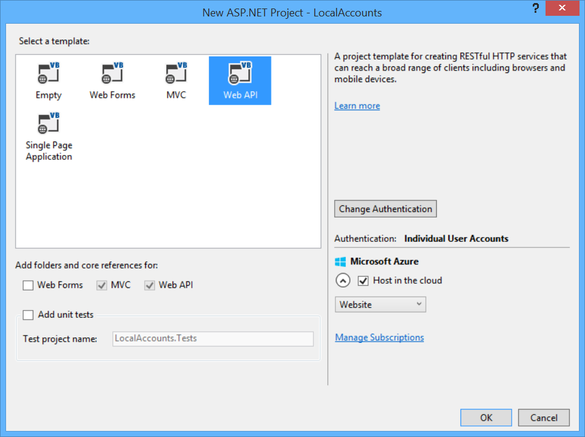
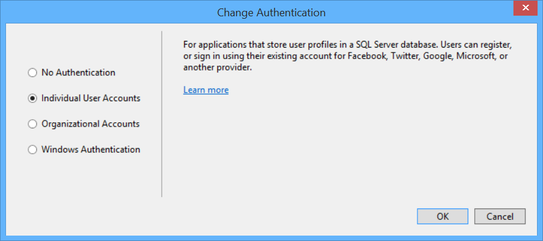
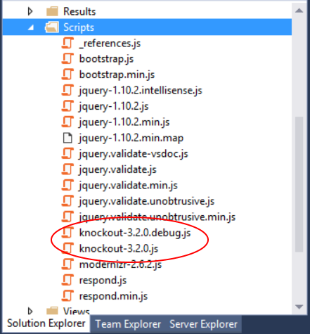

Secure a Web API with Individual Accounts and Local Login
================

This sample shows how to perform local login in ASP.NET Web API.

If you want to recreate this app from scratch, here are the steps that I followed. 

1. Create a new ASP.NET Web Application project. In the New Project dialog, select the Web API template.

	

1. If the dialog does not list **Individual User Accounts** under **Authentication**, click **Change Authentication**. Then select **Individual User Accounts**.

	

1. Add Knockout.js to the project, using NuGet. From the **Tools** menu, select **NuGet Package Manager** > **Package Manager Console**. In the console window, type the following command.

	`Install-Package knockoutjs`
	
	This adds the Knockout.js files to your Scripts folder.

	

1. In App_Start/BundleConfig.cs, add a new [script bundle](http://www.asp.net/mvc/tutorials/mvc-4/bundling-and-minification). 

        bundles.Add(new ScriptBundle("~/bundles/app").Include(
                  "~/Scripts/knockout-{version}.js",
                  "~/Scripts/app.js"));

1. Add the app.js file to Scripts folder. The code in app.js defines a [view model](http://knockoutjs.com/documentation/observables.html) for Knockout.js. The view model data-binds to the HTML form controls in the app.

1. Update Views/Home/Index.cshtml with the app UI. This file defines the MVC view for the home page. 

1. Enforce SSL. 
	- [Enable SSL for the project](http:/azure.microsoft.com/en-us/documentation/articles/web-sites-dotnet-deploy-aspnet-mvc-app-membership-oauth-sql-database/#bkmk_createmvc4app). 
	- Add the `RequireHttpsAttribute` filter to the MVC pipeline.
	 
	        public static void RegisterGlobalFilters(GlobalFilterCollection filters)
	        {
	            filters.Add(new HandleErrorAttribute());    
                // New code:
	            filters.Add(new RequireHttpsAttribute());
	        }

	- Add a custom `RequireHttpsAttribute` filter to the Web API pipeline. (See [Working with SSL in Web API](http://www.asp.net/web-api/overview/security/working-with-ssl-in-web-api).)  

            config.Filters.Add(new LocalAccountsApp.Filters.RequireHttpsAttribute());

	- Remove `AllowInsecureHttp` from `OAuthOptions`.

            OAuthOptions = new OAuthAuthorizationServerOptions
            {
                TokenEndpointPath = new PathString("/Token"),
                Provider = new ApplicationOAuthProvider(PublicClientId),
                AuthorizeEndpointPath = new PathString("/api/Account/ExternalLogin"),
                AccessTokenExpireTimeSpan = TimeSpan.FromDays(14)
                //AllowInsecureHttp = true
            };

1. I replaced the `ValuesController` class with the following code, just to make the Web API responses more interesting.

	    [Authorize]
	    public class ValuesController : ApiController
	    {
	        // GET api/values
	        public string Get()
	        {
	            var userName = this.RequestContext.Principal.Identity.Name;
	            return String.Format("Hello, {0}.", userName);
	        }
	    }
	
	This code adds the user name to the response, which shows the request has a valid principal.
